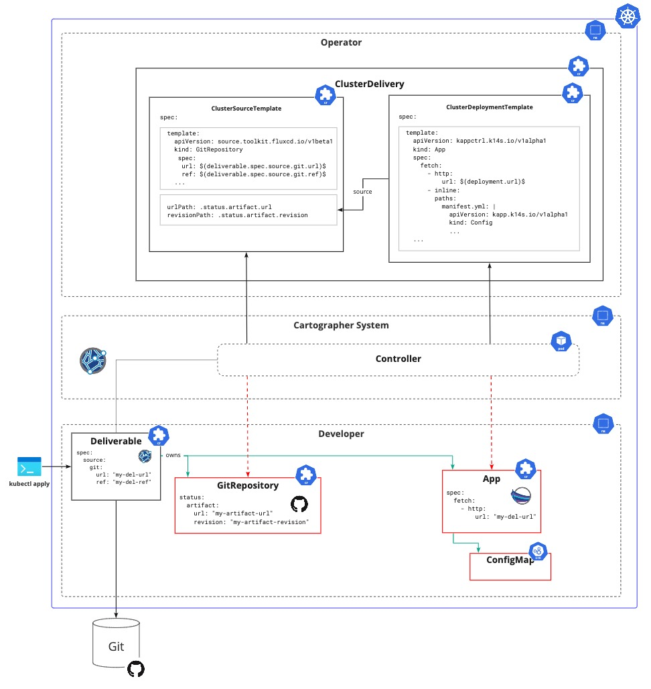

With the deployment configuration of our application available in a Git repository, we are now able to deploy it automatically to a fleet of clusters on every change. 
There are several tools for this job available, like ArgoCD or Carvel's kapp-controller.

Cartographer also provides a way to define a continuous delivery workflow that e.g. picks up that configuration from the Git repository to be promoted through multiple environments to first test/validate and finally run in production via the **ClusterDelivery**.

A **ClusterDelivery** is analogous to SupplyChain, in that it specifies a list of resources that are created when requested by the developer. Early resources in the delivery are expected to configure the k8s environment (for example, by deploying an application). Later resources validate the environment is healthy.
A **ClusterDeploymentTemplate** indicates how the ClusterDelivery should configure the environment.
A **Deliverable** allows the operator to pass information about the configuration to be applied to the environment to the ClusterDelivery.

For the sake of simplicity, we will now deploy our application to the same cluster we used for building it.
Let's first create a **Deliverable** resource to pass the required information to the ClusterDelivery. In this case, all is already available in the Workload and the ClusterSupplyChain parameters. Therefore, let's extend our Supply Chain to stamp out the Deliverable.
```editor:append-lines-to-file
file: simple-supply-chain/supply-chain.yaml
text: |2
    - name: deliverable
      templateRef:
        kind: ClusterTemplate
        name: simple-deliverable-template-{{ session_namespace }}
      params:
      - name: gitops_repository
        value: {{ ENV_GITOPS_REPOSITORY}}
```

```editor:append-lines-to-file
file: simple-supply-chain/deliverable-template.yaml
text: |2
  apiVersion: carto.run/v1alpha1
  kind: ClusterTemplate
  metadata:
    name: simple-deliverable-template-{{ session_namespace }}
  spec:
    template:
      apiVersion: carto.run/v1alpha1
      kind: Deliverable
      metadata:
        name: $(workload.metadata.name)$
        labels:
          end2end.link/workshop-session: {{ session_namespace }}
      spec:
        params:
        source:
          git:
            url: $(params.gitops_repository)$
            ref:
              branch: main
```

We will now create our full ClusterDelivery and after that implement all the required Templates.
```editor:append-lines-to-file
file: simple-supply-chain/delivery.yaml
text: |2
  apiVersion: carto.run/v1alpha1
  kind: ClusterDelivery
  metadata:
    name: simple-delivery-{{ session_namespace }}
  spec:
    selector:
      end2end.link/workshop-session: {{ session_namespace }}

    resources:
    - name: source-provider
      templateRef:
        kind: ClusterSourceTemplate
        name: simple-delivery-source-template-{{ session_namespace }}
    - name: deployer
      templateRef:
        kind: ClusterDeploymentTemplate
        name: simple-app-deploy-{{ session_namespace }}
      deployment:
        resource: source-provider
```
As you can see, the configuration of the ClusterDeliveries looks similar to ClusterSupplychain. You can specify the type of Deliverable they accept through the `spec.selector`, `spec.selectorMatchExpressions`, and `selectorMatchFields` fields and all of the resources via `spec.resources`.

ClusterSourceTemplates and ClusterTemplates are valid for ClusterDelivery. It additionally has the resource ClusterDeploymentTemplates. Delivery can cast the values from a ClusterSourceTemplate so that they may be consumed by a ClusterDeploymentTemplate.

Like for the Supply Chain, we will use the [Flux](https://fluxcd.io) Source Controller to watch our GitOps repository for changes.
```editor:append-lines-to-file
file: simple-supply-chain/delivery-source-template.yaml
text: |2
  apiVersion: carto.run/v1alpha1
  kind: ClusterSourceTemplate
  metadata:
    name: simple-delivery-source-template-{{ session_namespace }}
  spec:
    urlPath: .status.artifact.url
    revisionPath: .status.artifact.revision
    template:
      apiVersion: source.toolkit.fluxcd.io/v1beta1
      kind: GitRepository
      metadata:
        name: $(deliverable.metadata.name)$-delivery
      spec:
        interval: 1m0s
        url: $(deliverable.spec.source.git.url)$
        ref:
          branch: main
        secretRef:
          name: flux-basic-access-auth
```

Let's now continue with the creation of the **ClusterDeploymentTemplate**.
```editor:append-lines-to-file
file: simple-supply-chain/deployment-template.yaml
text: |2
  apiVersion: carto.run/v1alpha1
  kind: ClusterDeploymentTemplate
  metadata:
    name: simple-app-deploy-{{ session_namespace }}
  spec:
    observedCompletion:
      succeeded:
        key: '.status.conditions[?(@.type=="ReconcileSucceeded")].status'
        value: 'True'
      failed:
        key: '.status.conditions[?(@.type=="ReconcileSucceeded")].status'
        value: 'False'

    template:
      apiVersion: kappctrl.k14s.io/v1alpha1
      kind: App
      metadata:
        name: $(deliverable.metadata.name)$
      spec:
        serviceAccountName: default
        fetch:
          - http:
              url: $(deployment.url)$
          - inline:
             paths:
              config.yml: |
                ---
                apiVersion: kapp.k14s.io/v1alpha1
                kind: Config
                rebaseRules:
                  - path: [metadata, annotations, serving.knative.dev/creator]
                    type: copy
                    sources: [new, existing]
                    resourceMatchers: &matchers
                      - apiVersionKindMatcher: {apiVersion: serving.knative.dev/v1, kind: Service}
                  - path: [metadata, annotations, serving.knative.dev/lastModifier]
                    type: copy
                    sources: [new, existing]
                    resourceMatchers: *matchers

        template:
          - ytt: {}
        deploy:
          - kapp: {}
```

A **ClusterDeploymentTemplate** must specify criteria to determine whether the templated object has successfully completed its role in configuring the environment. Once the criteria are met, the ClusterDeploymentTemplate will output the deployment values. The criteria may be specified in `spec.observedMatches` or in `spec.observedCompletion`.

To fetch the latest deployment configuration from the url provided by the Flux Source Controller, we use Carvel's **kapp-controller**, which provides a declarative way to install, manage, and upgrade applications on a Kubernetes cluster using the **[App CRD](https://carvel.dev/kapp-controller/docs/v0.38.0/app-overview/)**.
The App CR comprises of three main sections:
- `spec.fetch` declares source for fetching configuration and OCI images
- `spec.template` declares templating tool and values
- `spec.deploy` declares deployment tool and any deploy specific configuration. Currently only Carvel’s kapp CLI is supported.

We are using a Knative Serving Service for our deployment. This resource type has immutable creator/lastModifer annotations that will be created if the resource is applied the first time. If Cartographer or kapp-controller applies updates to the resource due to a new input it "removes" them which results in a request denial by the admission webhook. Therefore, that additional ConfigMap is added which instructs kapp-controller to copy them from the resources already running in the cluster.

We are now able to apply our updated and new resources to the cluster ...
```terminal:execute
command: kapp deploy -a simple-supply-chain -f simple-supply-chain -y --dangerous-scope-to-fallback-allowed-namespaces
clear: true
```
... and can check whether everything is working as expected and the deployed application is accessible.
```terminal:execute
command: kubectl describe ClusterDelivery simple-delivery-{{ session_namespace }}
clear: true
```
```terminal:execute
command: kubectl tree deliverable simple-app
clear: true
```
```terminal:execute
command: kubectl describe deliverable simple-app
clear: true
```
```terminal:execute
command: kubectl describe app simple-app
clear: true
```
```terminal:execute
command: kubectl describe kservice simple-app
clear: true
```
```dashboard:open-url
url: http://simple-app-{{ session_namespace }}.cnr.{{ ENV_TAP_INGRESS }}
```

The following diagram (which is available in the documentation) of a similar ClusterDelivery shows the relationship between all those different resources.


The detailed specifications of the Deliverable, ClusterDelivery, and ClusterDeploymentTemplate can be found here: 
```dashboard:open-url
url: https://cartographer.sh/docs/v0.4.0/reference/deliverable/
```
```dashboard:open-url
url: https://cartographer.sh/docs/v0.4.0/reference/template/#clusterdeploymenttemplate
```

Now that you have a better understanding of how all the building blocks of Cartographer work, let's have a look what's out of the box with VMware Application Platform.

But before, let's delete the resources that we applied to the cluster.
```terminal:execute
command: |
  kubectl delete -f workload.yaml
  kapp delete -a simple-supply-chain -y
clear: true
```